# Stored Procedure

Stored Procedure adalah sebuah fungsi berisi kode SQL yang dapat digunakan kembali.

Dalam Stored Procedure juga dapat dimasukkan parameter sehingga fungsi dapat digunakan lebih dinamis berdasarkan parameter tersebut

## Cara penulisan Stored Procedure

```
DELIMITER //
CREATE PROCEDURE nama_procedure()
BEGIN
	kode sql
END //
DELIMITER ;
```

## Menjalankan Stored Procedure

```
CALL nama_procedure();
```

Pada langkah langkah berikut kita akan membuat procedure untuk ambil semua data siswa

## Langkah-Langkah

1. Pertama, untuk membuat stored procedure di phpmyadmin, pilih lah database yang ingin dibuatkan stored procedure. disini saya memilih database xi_rpl_1 yang saya sudah buat
2. 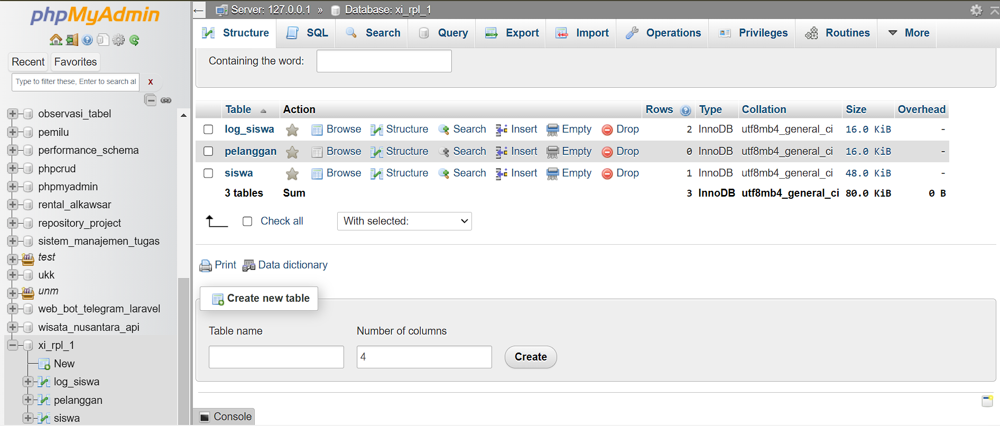
3. Kemudian pada navigasi pojok kanan atas, klik tombol `Routines`.
4. Setelah diklik, maka tampilannya seperti ini
5. 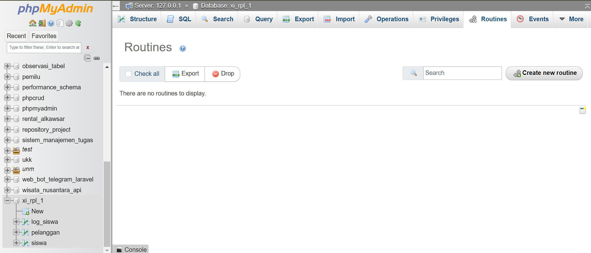
6. Kemudian, klik tombol `create new routine` untuk membuat stored procedure. maka akan tampil `pop up` seperti gambar dibawah ini.
7. 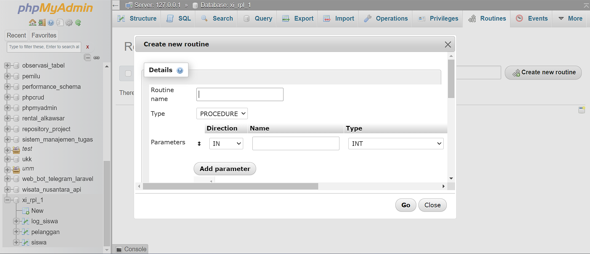

**Penjelasan dari masing-masing inputannya**

1. **routine name** : digunakan untuk memasukkan nama dari rutinitas yang ingin dibuat.
2. **type** : digunakan untuk memilih jenis rutinitas yang akan dibuat. Pilihan yang tersedia adalah "PROCEDURE" (prosedur) dan "FUNCTION" (fungsi)
3. **parameters** : digunakan untuk mendefinisikan parameter yang akan diterima oleh rutinitas. Setiap parameter memiliki beberapa atribut, yaitu:
   - **Direction (Arah)**: Menentukan arah parameter, apakah parameter tersebut masuk ke dalam rutinitas (IN), keluar dari rutinitas (OUT), atau keduanya (INOUT). Pada gambar, parameter yang ditentukan adalah IN.
   - **Name (Nama)**: Nama parameter yang digunakan di dalam rutinitas.
   - **Type (Tipe)**: Jenis data dari parameter, misalnya INT (integer), VARCHAR, DATE, dsb. Pada gambar, tipe yang dipilih adalah INT.
4. Tombol "Add parameter" digunakan untuk menambahkan parameter baru ke rutinitas.
5. **Definition**:

- Di sini Anda memasukkan kode SQL yang mendefinisikan apa yang akan dilakukan oleh rutinitas tersebut.

6. **Is deterministic**:
   - Centang kotak ini jika rutinitas selalu mengembalikan hasil yang sama dengan input yang sama (deterministik).
7. **Definer**:
   - Masukkan nama pengguna yang akan menjadi pembuat atau pemilik rutinitas ini.
8. **Security type**:
   - Pilih jenis keamanan untuk rutinitas. Pilihan biasanya adalah "DEFINER" (pendefinisi) atau "INVOKER" (pemanggil). "DEFINER" berarti rutinitas akan dijalankan dengan hak akses pengguna yang mendefinisikannya.
9. **SQL data access**:
   - Pilih jenis akses data SQL yang digunakan dalam rutinitas. Pilihan biasanya mencakup:
     - "CONTAINS SQL" (mengandung SQL)
     - "NO SQL" (tidak mengandung SQL)
     - "READS SQL DATA" (membaca data SQL)
     - "MODIFIES SQL DATA" (memodifikasi data SQL)
10. **Comment**: - Masukkan komentar atau catatan mengenai rutinitas ini (opsional).

---

11. Disini kita akan membuat stored procedure untuk ambil data siswa.
12. isilah kolom **routine name** dengan nama **ambilDataSiswa**
13. 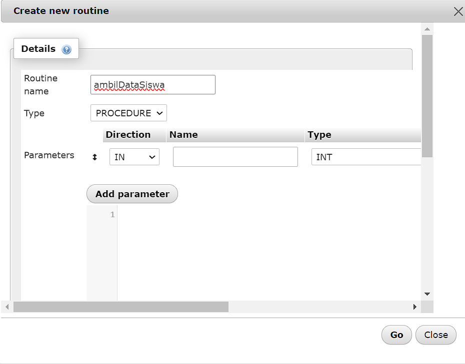
14. Setelah itu, disini kita tetap menggunakan tipe procedure, kemudian hapuslah inputan parameter dengan cara scroll kanan dan klik tombol drop
15. Selanjutnya, pada inputan Definition isilah query untuk ambil semua data siswa
16. 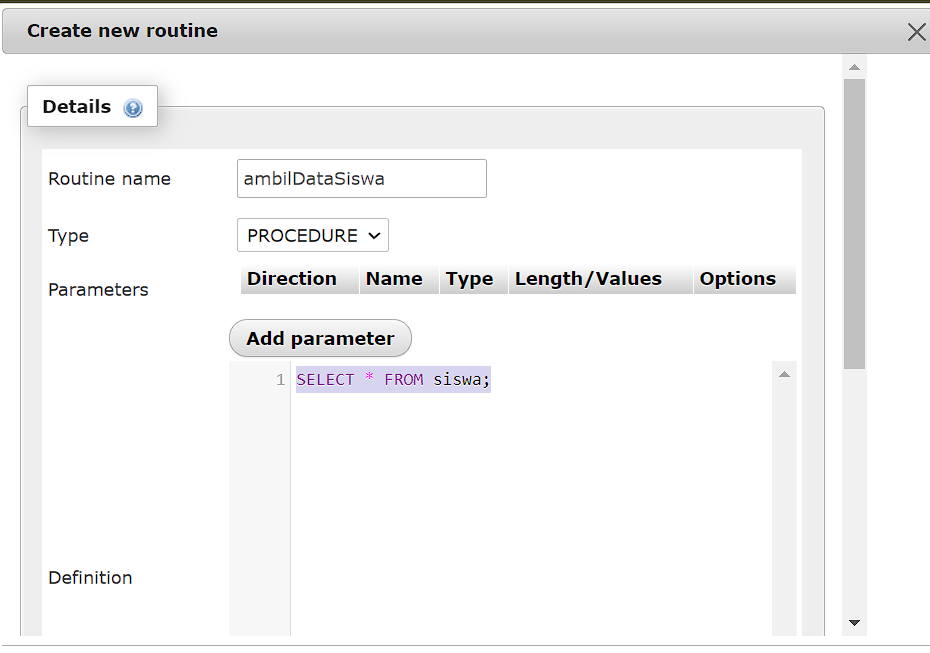
    Berikut query nya:

```mysql
SELECT * FROM siswa;
```

14. Kemudian klik tombol `go`
15. Setelah itu, maka akan tampil notifikasi berhasil membuat routine
16. 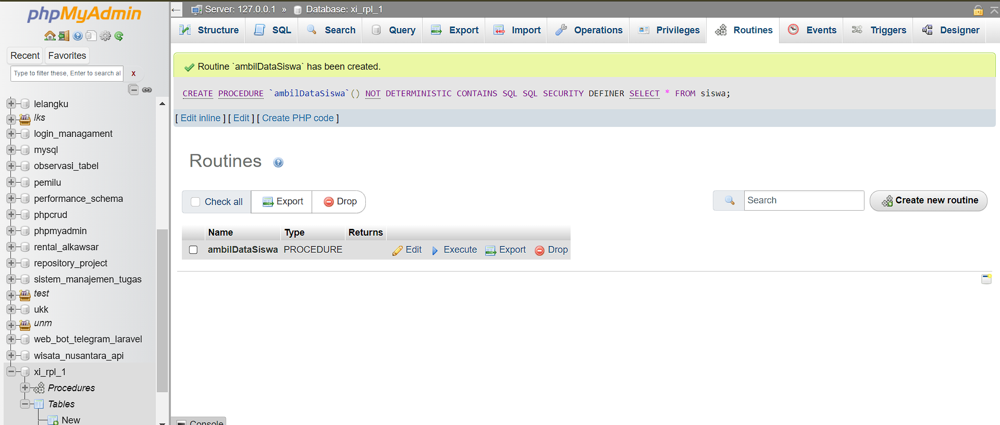
17. Kemudian untuk mengecek procedure kita telah berhasil bukalah kembali database tadi yang sudah kita berikan procedure
18. Maka akan tampil list `Procedures`, seperti gambar berikut pada pojok kiri bawah.
19. 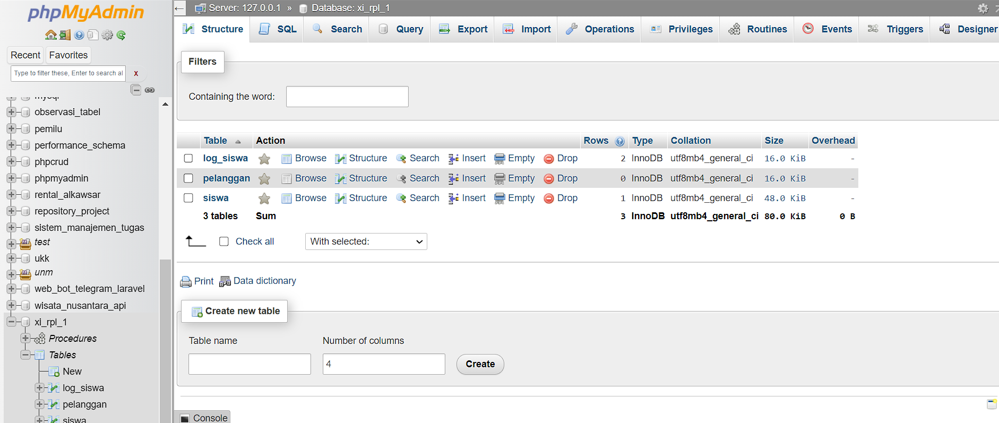
20. Klik `Procedures` tersebut
21. Maka akan tampil seperti gambar berikut
22. 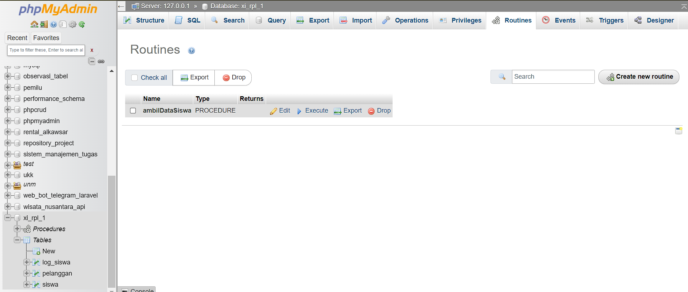
23. Dapat kita lihat procedure kita telah selesai kita buat, klik lah tombol execute untuk mengambil semua data siswa.
24. Setelah Anda klik, maka akan menampilkan semua data siswa.
25. 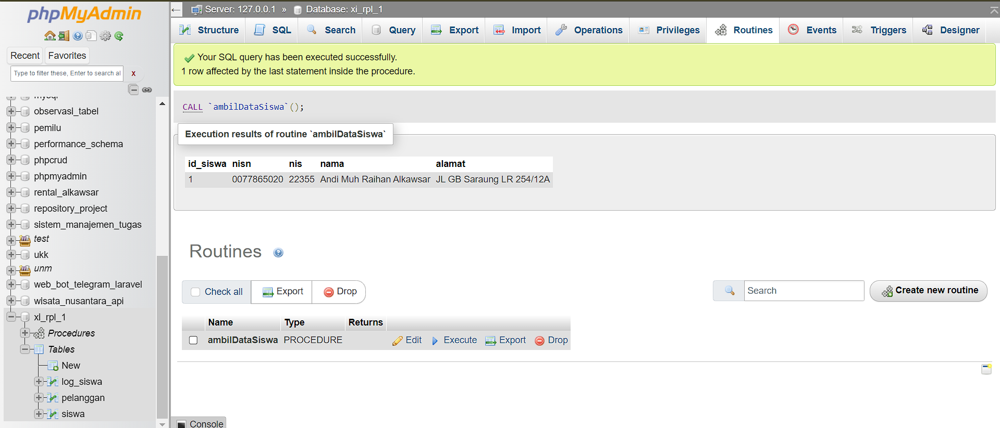
26. Kita telah berhasil membuat procedure dengan mengambil semua data siswa.

# Trigger

TRIGGER adalah kumpulan kode SQL yang berjalan secara otomatis untuk mengeksekusi perintah INSERT, UPDATE, DELETE.

Biasanya TRIGGER akan dijalankan sebelum atau sesudah proses INSERT, UPDATE, DELETE.

- **{BEFORE | AFTER}**: adalah waktu TRIGGER akan dijalankan, apakah sebelum atau sesudah database dimodifikasi oleh perintah DML
- **{INSERT | UPDATE | DELETE}**: adalah perintah DML yang mengaktifkan TRIGGER
- **ON** mendefinisikan table yang mengaktifkan TRIGGER
- **BEGIN END**: adalah pernyataan yang membungkus kode TRIGGER

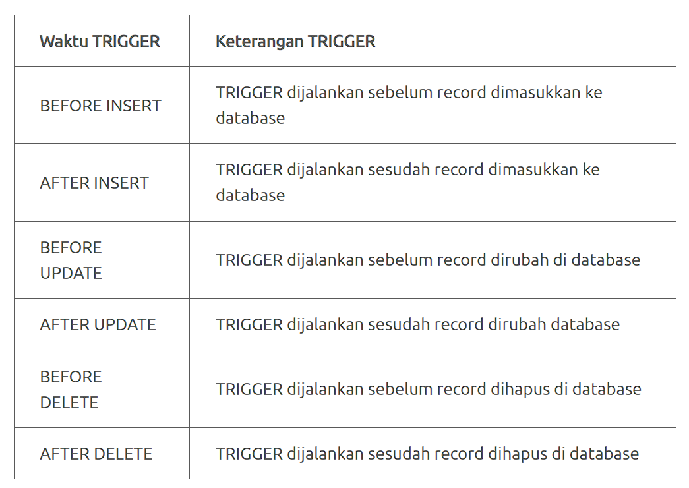

Pada langkah langkah berikut kita akan membuat 2 table yaitu **table siswa** dan **table log_siswa**

- ==`Tabel siswa`==: menyimpan data siswa
- ==`Tabel log_siswa`==: menyimpan perubahan data siswa

Jadi setiap ada perubahan data (UPDATE) alamat pada **table siswa** maka akan disimpan di **table log_siswa** tentang histori perubahan data alamat tersebut.

## Struktur Tabel yang Dibuat

### tabel siswa

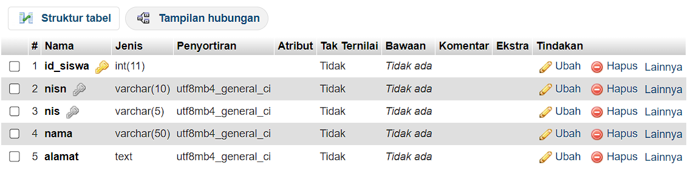

### tabel log_siswa

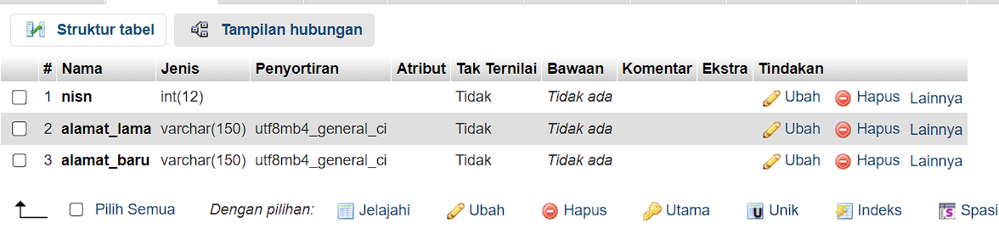

## Langkah - Langkah

1. Pertama, untuk membuat trigger di phpmyadmin, pilih lah database yang ingin dibuatkan trigger. disini saya memilih database xi_rpl_1 yang saya sudah buat
2. 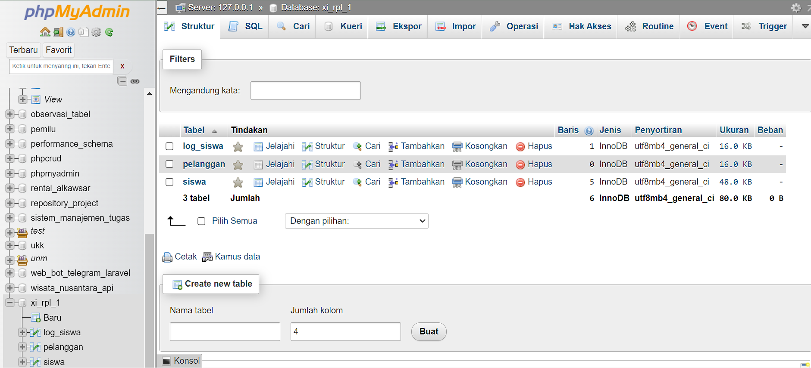
3. Kemudian pada navigasi pojok kanan atas, klik tombol trigger.
4. Setelah diklik, maka tampilannya seperti gambar dibawah ini.
5. 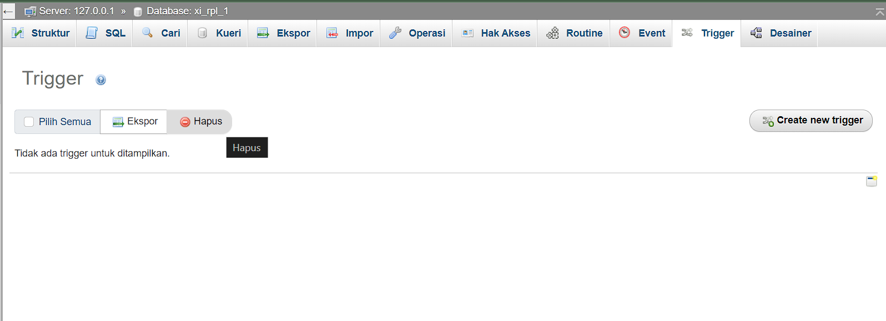
6. Setelah itu, klik tombol `create new trigger` untuk membuat trigger. maka akan tampil `pop up` seperti gambar dibawah ini.
7. 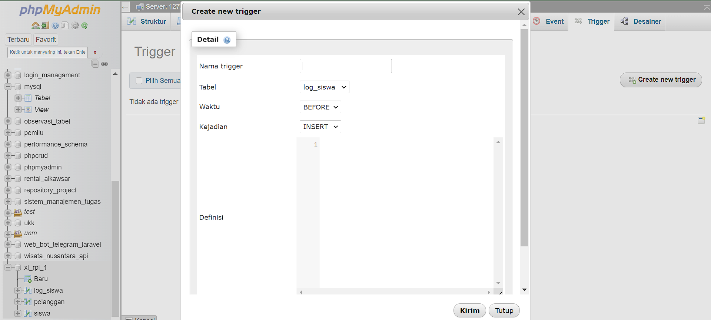
8. Selanjutnya, masukkan nama triggernya, disini kita akan membuat trigger ketika ada perubahan data alamat pada tabel siswa maka pada tabel log_siswa akan di update. isilah nama triggernya `update_alamat_siswa`
9. Setelah itu, ubah waktu menjadi ==`AFTER`== dan kejadian menjadi ==`UPDATE`==
10. Kemudian isi lah pada definisi dengan query berikut

```mysql
INSERT INTO log_siswa
VALUES (NEW.nisn, OLD.alamat, NEW.alamat)
```

9. 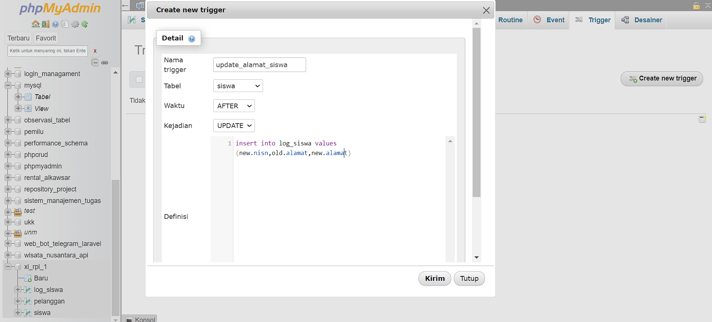
10. Setelah query nya di isi, klik tombol `kirim` untuk menyelesaikan trigger
11. 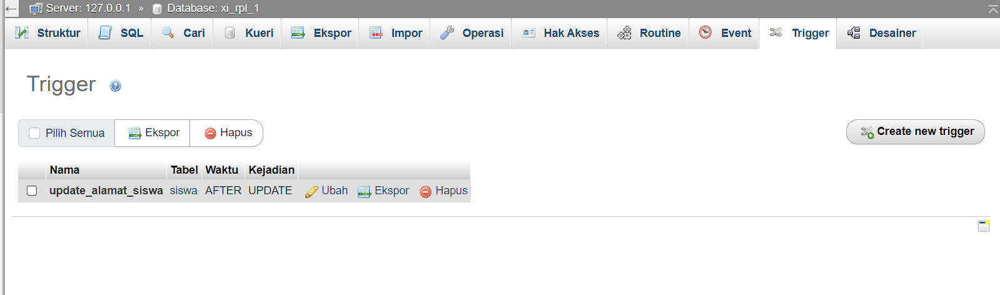
12. Jika sudah tampil seperti diatas, maka kita berhasil membuat trigger di phpmyadmin
13. Selanjutnya kita akan tes trigger yang sudah kita buat, update lah data yang ada di tabel siswa
    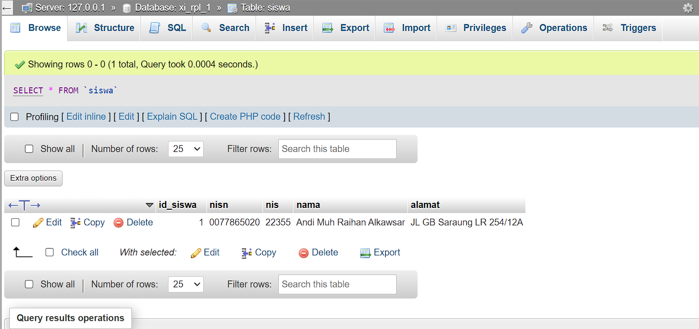
14. 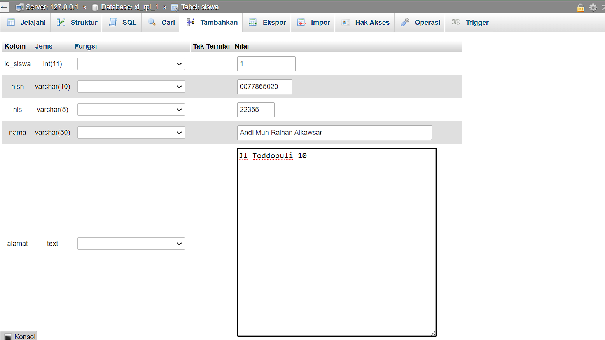
15. Setelah kita update di tabel siswa pada kolom alamat, cek lah di tabel log_siswa untuk melihat perubahan data alamat yang sudah kita update di tabel siswa
16. 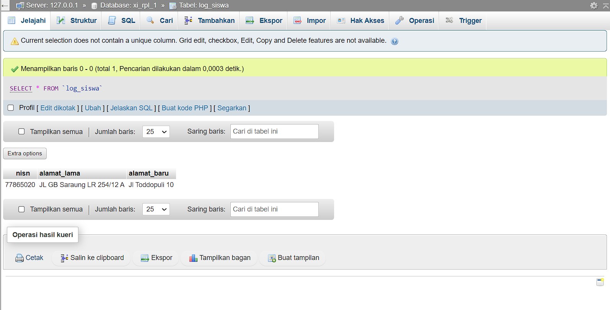
17. Anda telah berhasil membuat trigger di phpmyadmin mysql
